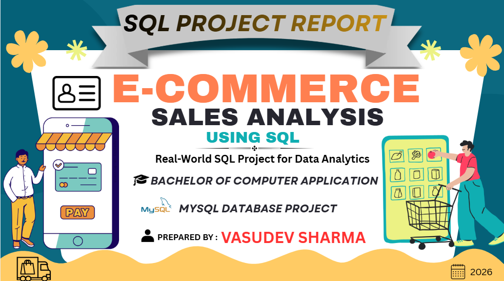
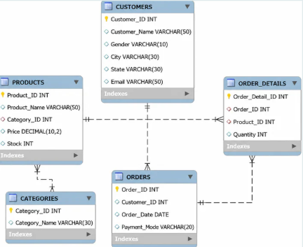
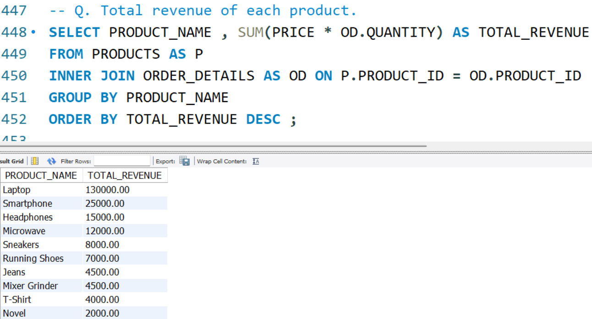
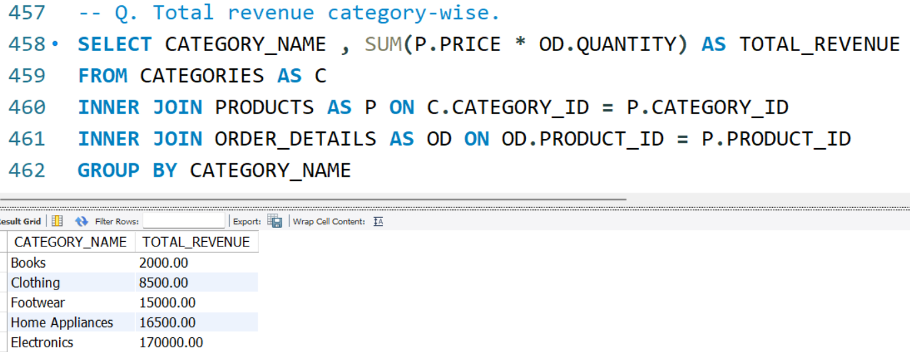
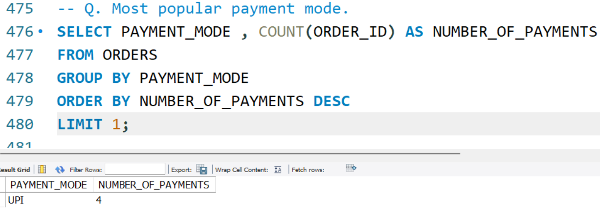
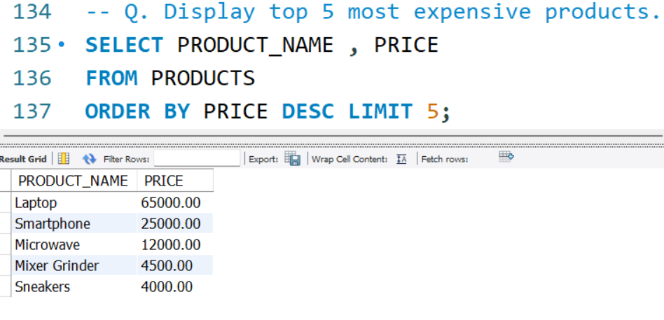

  

# 🛒 E-Commerce Sales Analysis SQL Project

## 📌 Project Overview
This project demonstrates SQL skills by analyzing an E-Commerce Sales database using MySQL. It includes 110+ SQL queries covering basic to advanced SQL concepts and business analysis.

## 🛠️ Tools Used
- MySQL Workbench
- SQL
- GitHub

## 📂 Database Tables
- Customers
- Orders
- Order_Details
- Products
- Categories

## 📚 SQL Concepts Used
- SELECT
- WHERE
- ORDER BY
- GROUP BY
- HAVING
- Aggregate Functions
- JOINS
- Subqueries
- CASE Expression
- Window Functions
- CTE
- Views

## 📊 Business Analysis
- Top Selling Products
- Product Revenue
- Category Revenue
- Most Popular Payment Mode
- Customer Purchase Analysis
- Sales Insights

## 📁 Project Files
- SQL Script (.sql)
- Project Documentation (.pdf)
- ER Diagram
- Query Output Screenshots

## 👨‍💻 Author
**Vasudev Sharma**

## 📷 Project Screenshots

### 🏠 Home Page

### 🗂️ ER Diagram

### 💰 Product Revenue

### 📊 Category Revenue

### 💳 Popular Payment Mode

### 💎 Top 5 Most Expensive Products

